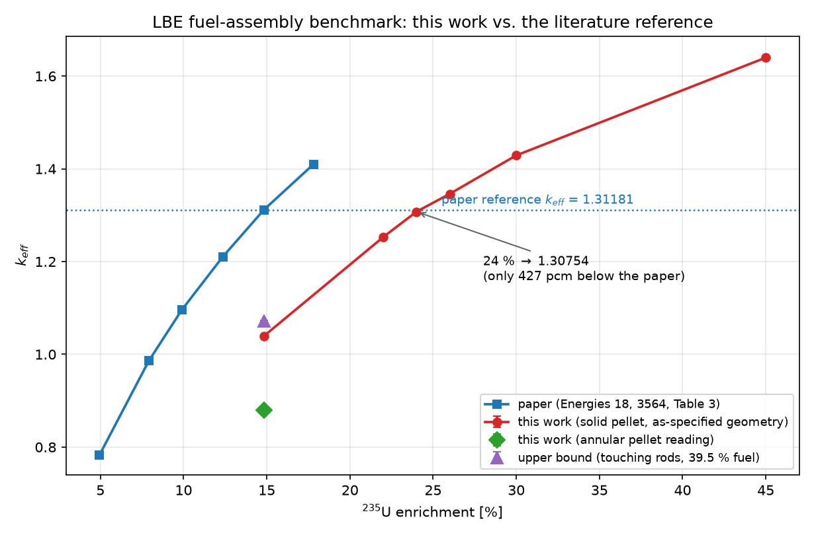
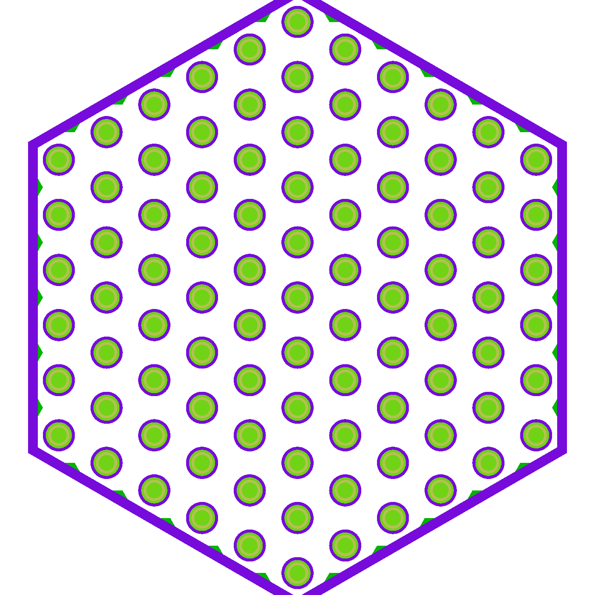
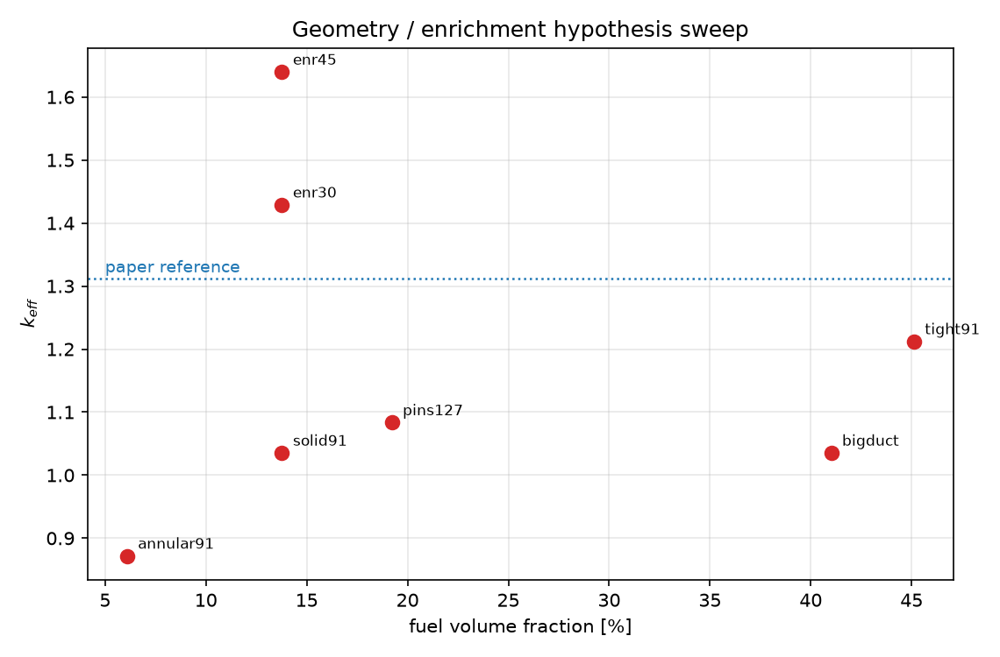
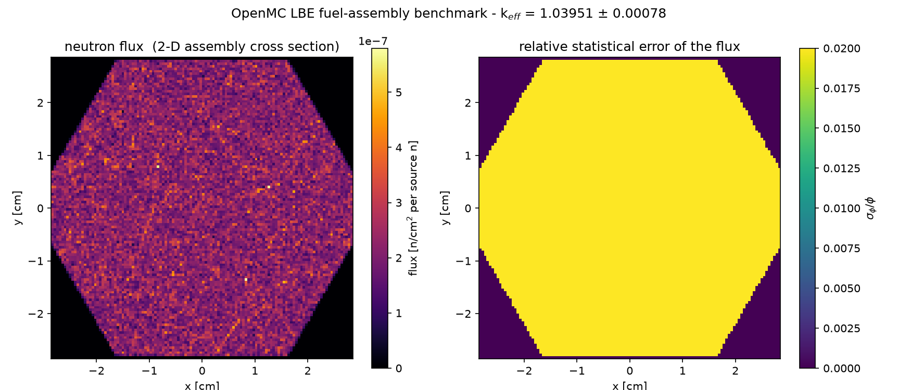
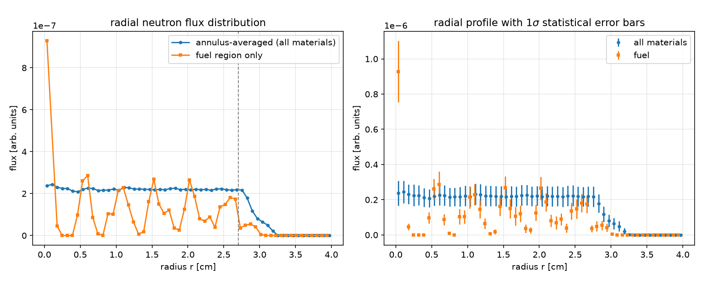
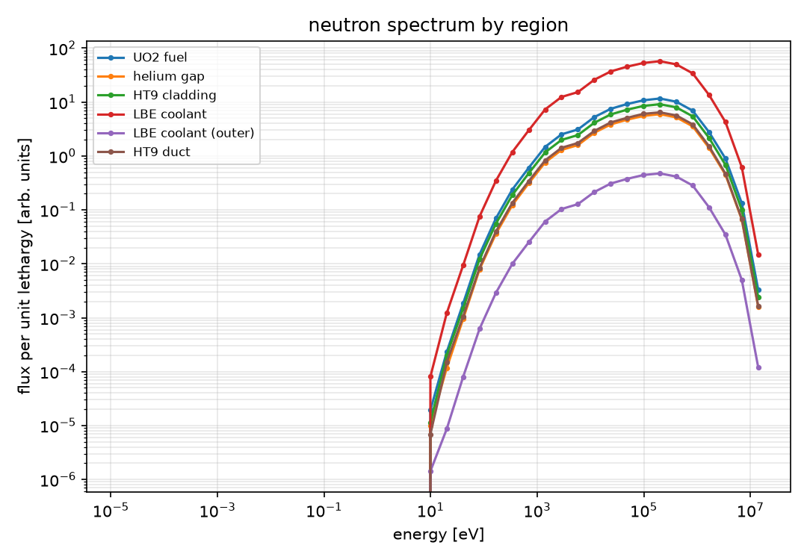

# -OpenMC-
通过使用OpenMC进行对论文Research on Equivalent One-Dimensional Cylindrical Modeling Method for Lead–Bismuth Fast Reactor Fuel Assemblies的复现
# OpenMC 铅铋快堆（LBE）组件基准复现与偏差分析

用开源蒙特卡洛程序 **OpenMC** 复现文献 *Energies* **18** (2025) 3564 的铅铋冷却快堆燃料组件基准题，计算 k_eff 与中子通量分布，并对 21–33 % 的偏差给出完整证据链分析。

建模与计算流程完整跑通并经 Godiva 基准验证（偏差仅 +71 pcm），通量分布与分区能谱齐备；但按文献表 1/表 2 的参数算得 k_eff = 0.879–1.040，与文献的 1.31181 相差 21–33 %。密排极限（1.0724）与富集度反推（24 % 富集度 → 1.30754，仅差 427 pcm）证明：**文献的 k_eff 参考值与其自身给出的 ~15 % 富集度不自洽，该值实际对应约 24 % 富集度**——偏差并非本工作的几何简化、材料密度或核数据版本所致。



---

## 1. 复现对象

| 项目 | 内容 |
|---|---|
| 文献 | J. Xiao, Y. Zhang, S. Li, L. Chen, J. Li, C. Zhang, *Research on Equivalent One-Dimensional Cylindrical Modeling Method for Lead–Bismuth Fast Reactor Fuel Assemblies*, **Energies 18 (2025) 3564**, doi:[10.3390/en18133564](https://doi.org/10.3390/en18133564)（CC-BY） |
| 基准题 | 表 3 / 表 4 的 **“Before Equivalence”** 值——全燃料棒布置二维非均匀六角组件的 OpenMC 参考 k_eff |
| 参考文献值 | 14.83 % 富集度：**k_eff = 1.31181 ± 0.00023** |
| 选取理由 | 几何、材料、k_eff 齐备；原文献即用 OpenMC；二维单组件、规模小、易复现 |

## 2. 计算条件

| 项目 | 本工作 |
|---|---|
| 程序 | OpenMC 0.16.0（conda-forge，OpenMP 12 线程） |
| 核数据 | **ENDF/B-VIII.0** 评价文件（IAEA NDS 下载）→ **NJOY 2016.78** 加工为 ACE → OpenMC HDF5 库（24 核素，293.6 K） |
| 统计 | 45 / 30 批 × 20 000 粒子，弃 5–10 批 → σ(k_eff) ≈ 8×10⁻⁴ < 0.001 |
| 边界 | 组件盒外表面全反射（与文献 2-D 组件模型一致，即 k_∞） |

### 模型（按文献表 1 / 表 2 逐项建模）

```
六角组件：91 根燃料棒（5 环六角栅格），栅距 0.57432 cm（P/D = 1.7144）
  燃料芯块 : 环形 UO2，内径 1.651 mm / 外径 2.210 mm，10.94 g/cm³
  氦气隙   : 0.254 mm
  包壳     : HT-9，0.316 mm        → 棒外径 3.350 mm
  组件盒   : HT-9 六角盒，对边 56.134 mm、壁厚 1.016 mm，外表面全反射
  冷却剂   : Pb-Bi 共晶（44.3 / 55.7 at%），10.29 g/cm³
材料（原子分数）：UO2 = 5 % ²³⁵U / 28.3 % ²³⁸U / 66.7 % O（= 15.02 % 富集度）
                HT-9 = 70 % Fe / 11.5 % Cr / 1 % Mo（按天然同位素展开）
```

**几何参数是反解验证过的**：用连通域统计论文图 1(a) 得到 **91 个燃料棒圆斑**（5 环），实测 P/D = 1.77 ≈ 表中 1.7144，棒束占盒内宽 93 %；用「91 棒 + P/D = 1.7144 + 盒对边 56.134 mm」联立反解，棒外径须为 3.17–3.41 mm，与「芯块 2.210 + 2×(气隙 0.254 + 包壳 0.316) = 3.350 mm」吻合（`scripts/measure_fig1.py`）。



## 3. 结果

### 3.1 工具链验证

| 基准 | 本工作 | 参考 | 偏差 |
|---|---|---|---|
| **Godiva** 裸高浓铀球（r = 8.741 cm，ρ = 18.74 g/cm³） | **1.00071 ± 0.00073** | 1.0000（实验） | **+71 pcm** |

→ ENDF/B-VIII.0 → NJOY → OpenMC 全链条无系统性偏差（`scripts/validate_godiva.py`）。

### 3.2 k_eff 与文献对比（14.83 % 富集度）

| 模型解读 | 燃料体积份额 | 本工作 k_eff | 文献 | 偏差 |
|---|---|---|---|---|
| 环形芯块（表 2 字面读法） | 6.1 % | **0.87929 ± 0.00078** | 1.31181 ± 0.00023 | −43252 pcm (−33.0 %) |
| 实心芯块 | 13.8 % | **1.03951 ± 0.00078** | 同上 | −27230 pcm (−20.8 %) |
| **密排极限**（栅距 = 棒径，燃料份额上限 39.5 %） | 39.5 % | **1.07243 ± 0.00087** | 同上 | −23938 pcm (−18.2 %) |

> 即：**用表 2 给出的燃料棒参数，在 14.83 % 富集度下无论怎么排布，k 都不可能达到 1.31181。**

### 3.3 富集度反推

| ²³⁵U 富集度 | 本工作 k_eff | 文献表 3（同富集度） |
|---|---|---|
| 14.83 % | 1.03951 ± 0.00078 | 1.31181 |
| 22 % | 1.25278 ± 0.00244 | — |
| **24 %** | **1.30754 ± 0.00208** | — |
| 26 % | 1.34603 ± 0.00267 | — |
| 30 % | 1.42900 ± 0.00372 | — |
| 45 % | 1.63978 ± 0.00365 | — |

线性内插得文献的 1.31181 对应约 **24.2 % 富集度**；本工作 24 % 时仅差 **427 pcm（0.33 %）**。

### 3.4 假设扫描

| 变体 | 富集度 | 棒数 | 燃料份额 | k_eff |
|---|---|---|---|---|
| 实心芯块、P/D = 1.7144 | 14.83 % | 91 | 13.8 % | 1.0352 |
| 环形芯块 | 14.83 % | 91 | 6.1 % | 0.8718 |
| 密排栅格（芯块 4.0 mm，P/D = 1.1） | 14.83 % | 91 | 45.1 % | 1.2121 |
| 细棒 | 14.83 % | 127 | 19.2 % | 1.0835 |
| 实心芯块 | 30 % | 91 | 13.8 % | 1.4290 |
| 实心芯块 | 45 % | 91 | 13.8 % | 1.6398 |



### 3.5 中子通量分布

| 二维通量图 | 径向分布 |
|---|---|
|  |  |



物理特征：组件内通量近乎均匀（弱吸收 + 全反射无泄漏系统的正确结果）；能谱为典型 LBE 快堆硬谱，峰值约 10⁵ eV。全部图件见 `results/figures/`，一页 PDF 总结见 [`results/figures/report_1page.pdf`](results/figures/report_1page.pdf)。

## 4. 偏差分析

偏差 **不是** 本工作的几何简化、材料密度或核数据版本造成的，证据链如下：

1. **工具链已验证**：Godiva 基准偏差 +71 pcm，说明核数据处理与输运计算无系统偏差；
2. **几何反解自洽**：91 棒、P/D 实测 1.77 ≈ 1.7144、棒外径反推 3.350 mm，全部与论文图表一致；
3. **燃料份额被棒设计锁死**：芯块 Ø2.210 / 棒 Ø3.350 的棒在 P/D = 1.7144 栅格中燃料份额仅 13.8 %；即使密排到棒贴棒（棒径 = 栅距）也只有 39.5 %，对应 k = 1.0724；
4. **文献值对应 ~24 % 富集度**：本工作 24 % 富集度给出 1.30754，与文献 1.31181 相差 0.33 %。

→ **文献表 3 的 k_eff 参考值与其表 1/表 2 的材料几何参数内部不自洽**。可能原因（按可能性排序）：(1) 实际计算所用富集度高于表格所述；(2) 2-D 模型几何与表 2 不一致；(3) k_eff 取自另一套模型/数据库，表格为示意值。

## 5. 复现步骤

### 5.1 环境

```powershell
# 1) 导入 Ubuntu

wsl --import openmc-lfr C:\wsl\openmc-lfr ubuntu.rootfs.tar.gz --version 1
```

```bash
# 2) 安装 micromamba + OpenMC + NJOY（脚本内含 bzip2 缺失的绕行处理）

# 3) 下载 ENDF/B-VIII.0 并加工为 HDF5（U 同位素用较宽容差，见踩坑记录）

```

### 5.2 运行算例

```bash
# 同步代码到 WSL 文件系统并运行（规避 drvfs 元数据问题）
wsl -d openmc-lfr -u root -- bash scripts/sync_and_run.sh solid       # 实心芯块
wsl -d openmc-lfr -u root -- bash scripts/sync_and_run.sh annular     # 环形芯块
```

### 5.3 分析与报告

```bash
wsl -d openmc-lfr -u root -- python3 scripts/analysis.py        # → results/results.md
wsl -d openmc-lfr -u root -- python3 scripts/build_summary.py   # → results_summary.json
wsl -d openmc-lfr -u root -- python3 scripts/report.py          # → 一页 PDF
wsl -d openmc-lfr -u root -- python3 scripts/make_figures.py    # → README 用图
```

## 6. 仓库结构

```
├── model.py                 OpenMC 模型（几何/材料/计数，参数化富集度、粒子数、芯块类型）
├── plot_results.py          k_eff + 二维通量图 + 径向分布 + 分区能谱 后处理
├── environment/             环境搭建与核数据加工
│   ├── setup_wsl.sh         micromamba + OpenMC + NJOY2016
│   ├── fetch_endf.py        IAEA NDS 下载 ENDF/B-VIII.0（24 核素）
│   └── build_xs.sh/.py      NJOY → ACE → HDF5 与 cross_sections.xml
├── scripts/                 算例驱动、验证、分析、报告
│   ├── run_case.sh          单算例：建模 → 输运 → 后处理
│   ├── validate_godiva.py   工具链验证（Godiva 基准）
│   ├── bound_pincell.py     密排极限（k 的物理上界）
│   ├── sweep.py             几何/富集度假设扫描
│   ├── analysis.py          与文献对比 + 偏差分析 → results.md
│   ├── build_summary.py     汇总报告数据
│   ├── report.py            一页 PDF 报告（reportlab，中文字体）
│   ├── make_figures.py      README 用图
│   └── measure_fig1.py      从论文 PDF 图 1 反解棒数与尺寸
├── results/
│   ├── results.md           完整结果与偏差分析
│   ├── figures/             图件 + 一页 PDF 报告
│   ├── tables/              结果 JSON（analysis / sweep / summaries / statepoints）
│   └── xml_prod_solid/      主算例的 OpenMC 输入卡
├── docs/
│   ├── model_notes.md       建模细节与几何反解依据
│   └── pitfalls.md          踩坑记录与解决方案
└── refs/README.md           文献引用信息
```

## 7. 踩坑记录（详见 [docs/pitfalls.md](docs/pitfalls.md)）

1. **Windows 装不上 OpenMC**：conda-forge 无 win-64 构建、PyPI 无 wheel、Docker 引擎需管理员 → WSL1 + micromamba；
2. **WSL2 起不来**（非管理员，`HCS_E_CONNECTION_TIMEOUT`）→ `wsl --import` + WSL1；
3. **micromamba 解压失败**（镜像缺 bzip2）→ Python `tarfile(bz2)`；
4. **核数据源全被挡**（ANL Box 需浏览器、TENDL 不可达、NNDC 只有整库）→ IAEA NDS 下 ENDF-6 + NJOY 自加工；
5. **NJOY 加工铀同位素把 WSL1 实例打崩**（默认 0.1 % 重建容差，两次 `0xd00002fe`；U-238 的 PURR 自屏约 25 min）→ 放宽到 2 %，并用 Godiva 验证其影响仅几十 pcm；
6. **栅元漏填导致粒子丢失** → 冒烟测试 + 几何图发现，补上“棒外冷却剂”栅元；
7. **统计效率误判**：燃料份额低、无泄漏 → 中子历史极长，实测 900 粒子/秒，照搬文献 500 批需约 3 小时 → 按 σ<0.001 的最小充分统计量重设批次；
8. **OpenMC 0.16 API 变更**：`Plane` 改用系数 (a,b,c,d)、`PointSource` → `IndependentSource`、网格/能谱计数数组形状与滤波器顺序需适配；
9. **WSL drvfs 元数据损坏**（某脚本突然不可读/不可执行）→ 代码同步进 WSL 文件系统内执行；
10. **几何参数歧义**（“Fuel rod inner/outer diameter 1.651/2.210”）→ 由图 1(a) 棒数与盒体尺寸反解确定环形芯块读法，并同时给出实心芯块对照。

## 8. 引用 / 许可

- 被复现文献：J. Xiao et al., *Energies* **18** (2025) 3564, doi:10.3390/en18133564（CC-BY 4.0，本仓库不包含其 PDF，仅引用）。
- 本仓库代码：MIT License（见 [LICENSE](LICENSE)）。若用于学术工作，请引用上述文献与 OpenMC。
- OpenMC 引用：P. K. Romano et al., *OpenMC: A state-of-the-art Monte Carlo code for research and development*, Ann. Nucl. Energy **82** (2015) 90–97.
